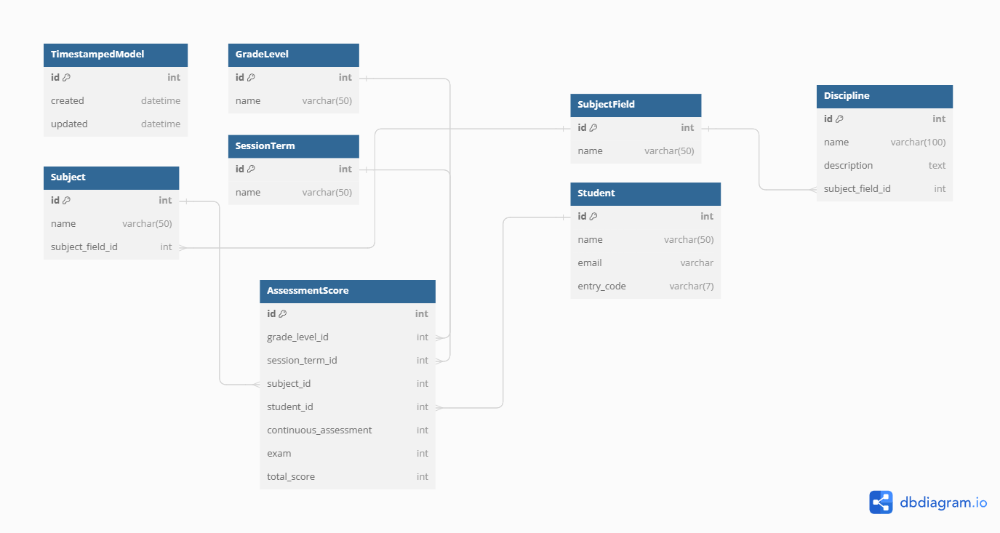
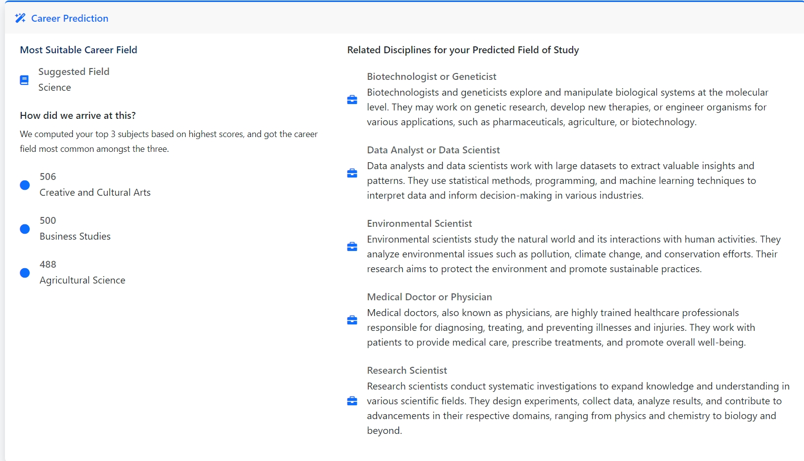

# Career Compass


**A Career Counselor Web Application for Junior Secondary School Students based on their academic performance from JSS 1-3**

You can view the application demo [here](http://careercounseling.pythonanywhere.com/)


## Contents

- [About the Project](#about-the-project)
  * [How does it Work](#how-does-it-work)
- [Getting Started](#getting-started)
  * [Built with](#built-with)
  * [Installation](#installation)
- [Running Tests](#running-tests)
- [Contributing](#contributing)
- [Support](#support)
- [Changelog](#changelog)
- [License](#license)
- [Contact](#contact)

## About The Project

This application is for students who are about to enter Senior Secondary School. Using their grades from Junior Secondary School 1-3, the application helps them decide on what field of study to go for in **Science**, **Arts**, **Humanties** or **Commercials**, based on their academic performance.



### How does it Work

This system operates by following these key steps:

1. Via the admin interface, a student object is created, and assessment scores, including continuous assessment and exam scores, are entered into the system.

2. An access code which is generated will be sent to the email address of the student whose data was created.

3. Using the access code sent, a student can access a dedicated page that presents analysis result, and identifies their top subjects with the suggested field of study and related disciplines.



## Getting Started

### Built with

- **Django**: This Python web framework is used for building the backend logic, including models for storing assessment data, and view to calculate to the assessment scores and recommend field of study.

- **Chart.js**: This javascript library is utilized to visualize analysis results and present assessment score statistics in a graphical format.

- **Bootstrap**: This CSS framework is employed to design the landing page and assessment dashboard of the student.

### Installation

_Follow the steps below to get the program working on your system locally. These steps are tailored for users developing on Linux OS with Python installed already._

1. Clone the repo
   ```sh
   git clone https://github.com/Pythonian/career_counseling.git
   ```
2. Change into the directory of the cloned repo
   ```sh
   cd career_counseling
   ```
3. Setup a Python virtual environment and activate it
   ```sh
   make venv
   source venv/bin/activate
   ```
4. Install project requirements
   ```sh
   make install
   ```
5. Copy and edit environment variables with desired values
   ```sh
   cp .env.example .env
   ```
6. Run database migrations
   ```sh
   make migrate
   ```
7. Create an admin superuser
   ```sh
   make admin
   ```
   _Note: Use `admin` for both the `username` and `password`, and skip entering the `email`. Also type `y` to bypass Password validation._

8. Populate the database with fake data (Optional)
   ```sh
   make populatedb
   ```
9. Run the development server
   ```sh
   make run
   ```
10. Visit the URL in your browser
   ```sh
   127.0.0.1:8000
   ```
   You can also visit the admin dashboard in a new tab and login with the credentials created in step 7.
   ```sh
   127.0.0.1:8000/admin/
   ```

If you went ahead with the optional step (8), you can copy the access code for one of the students here `http://127.0.0.1:8000/admin/career/student/` and use it to access the student assessment dashboard.

## Running Tests

To run tests, run the following command

```bash
   make test
```

## Contributing

Contributions are always welcome! Any contributions you make are **greatly appreciated**.

If you have a suggestion that would make this project better, please fork the repo and create a pull request. You can also simply open an issue with the tag "enhancement".

Don't forget to give the project a star! Thanks again!

1. Fork the Project
2. Create your Feature Branch (`git checkout -b feature/AmazingFeature`)
3. Commit your Changes (`git commit -m 'Add some AmazingFeature'`)
4. Push to the Branch (`git push origin feature/AmazingFeature`)
5. Open a Pull Request

## Support

If you encounter any bug or problem while using the project, please [open an issue](https://github.com/Pythonian/career_counseling/issues)

## Changelog

For a detailed list of changes, see the [Changelog](docs/CHANGELOG.md).

## License

This project is licensed under the [MIT License](LICENSE.md).

## Contact

If you have any questions, suggestions, or feedback, feel free to reach out to me

Seyi Pythonian - [@Ajibel](https://twitter.com/Ajibel) - [seyipythonian@gmail.com](mailto:seyipythonian@gmail.com)
